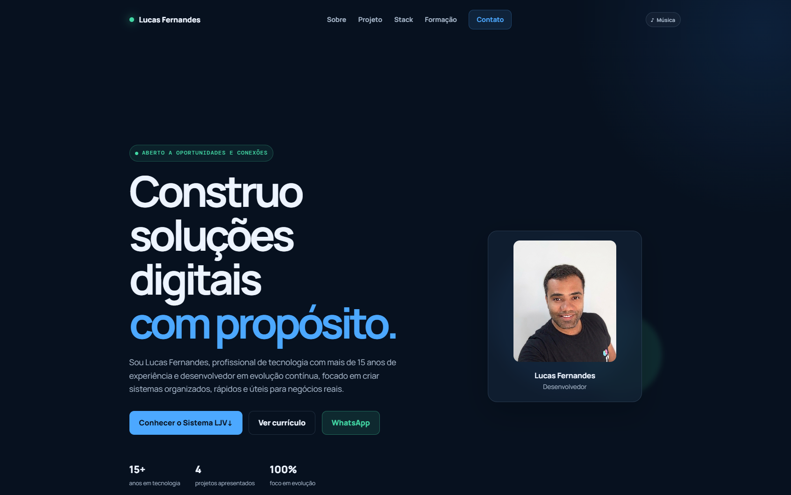

# 🚀 Portfólio | Lucas Fernandes

<p align="center">
  
</p>

<p align="center">
  Portfólio pessoal responsivo desenvolvido com HTML, CSS e JavaScript.<br>
  Projetos de software, trajetória profissional, competências técnicas e certificações em um só lugar.
</p>

## ✨ Destaques

- 📱 Interface fluida para celulares, tablets e desktops.
- 🧩 Projetos com imagens ampliáveis em galeria modal.
- 📬 Contatos diretos por Gmail, WhatsApp, LinkedIn e GitHub.
- 🎓 Currículo e certificados organizados por instituição de ensino.
- 🎵 Música ambiente controlada pela pessoa visitante.
- 🌐 Favicon preparado para navegadores, Android, iOS, Windows e Linux.
- ⚡ Site estático, leve e sem dependências de build.

## ⭐ Projeto em destaque: Sistema LJV

O **Sistema LJV** é uma aplicação web serverless voltada à gestão comercial. O projeto apresenta funcionalidades de PDV, estoque, financeiro, relatórios, usuários, permissões e auditoria para apoiar rotinas operacionais.

Pontos técnicos apresentados:

- TypeScript no frontend e no backend.
- Cloudflare Workers e Cloudflare D1, baseado em SQLite.
- Hono para roteamento HTTP e Zod para validação.
- Regras críticas centralizadas no backend.
- Auditoria, permissões granulares e valores monetários armazenados em centavos.

> O repositório público contém somente código e documentação técnica. Credenciais, dados operacionais e backups não são versionados.

🔗 [Conheça o repositório do Sistema LJV](https://github.com/Lcsf-dev/sistema-ljv)

## 🧩 Outros projetos apresentados

| Projeto | Tecnologias | Repositório |
| --- | --- | --- |
| SEV — Sistema de Estoque e Vendas | Visual Basic 6, ADO, SQL Server, T-SQL | [Abrir](https://github.com/Lcsf-dev/sistema-estoque-vendas-vb6) |
| Sistema de Sorteio e Gerenciamento de Torneios | Python, Flask, SQLite, HTML, CSS e JavaScript | [Abrir](https://github.com/Lcsf-dev/pokemon-champions) |
| Mini Gestor de Despesas | Visual Basic 6, ADO e SQL Server | [Abrir](https://github.com/Lcsf-dev/mini-gestor-despesas) |

## 🛠️ Tecnologias

- **Linguagens e web:** Java, Python, JavaScript, TypeScript, HTML5, CSS3 e Visual Basic 6.
- **Back-end:** Spring Boot, Flask, Cloudflare Workers, Hono e Zod.
- **Dados:** SQL Server, PostgreSQL, SQLite e Cloudflare D1.
- **Ferramentas e plataformas:** Git, GitHub, Cloudflare, Wrangler, Netlify e Microsoft Azure.

## 📂 Estrutura

```text
.
├── audio/                 # Música ambiente
├── certificates/          # Certificados de formação
├── icons/                 # Favicons e ícones de aplicativo
├── imagens/               # Foto, capa e imagens dos projetos
├── index.html             # Estrutura e conteúdo do site
├── style.css              # Design system e responsividade
├── main.js                # Menu, modal, música e animações
├── site.webmanifest       # Metadados para Android e PWA
└── browserconfig.xml      # Suporte complementar ao Windows
```

## 💻 Executar localmente

Não há dependências para instalar.

1. Abra esta pasta no VS Code.
2. Abra `index.html` no navegador ou use uma extensão de servidor local, como Live Server.
3. Para conferir mudanças no favicon, recarregue a página com `Ctrl + F5`.

## ☁️ Publicação

O projeto pode ser publicado na **Netlify** com o diretório raiz como pasta de publicação, pois o `index.html` está na raiz deste repositório.

O **GitHub Pages** é publicado automaticamente por GitHub Actions após cada envio para a branch `main`.

## ♿ Qualidade e acessibilidade

- Navegação por teclado e atalho para pular ao conteúdo.
- Elementos interativos com rótulos acessíveis.
- Imagens com texto alternativo.
- Preferência de redução de movimento respeitada.
- Layout sem dependência de largura fixa de tela.

## 📫 Contato

- [GitHub](https://github.com/Lcsf-dev)
- [LinkedIn](https://www.linkedin.com/in/lucasfernandes-dev/)
- [WhatsApp](https://wa.me/5521993449434)
- [E-mail](mailto:lucas.lcsf.dev@gmail.com)
